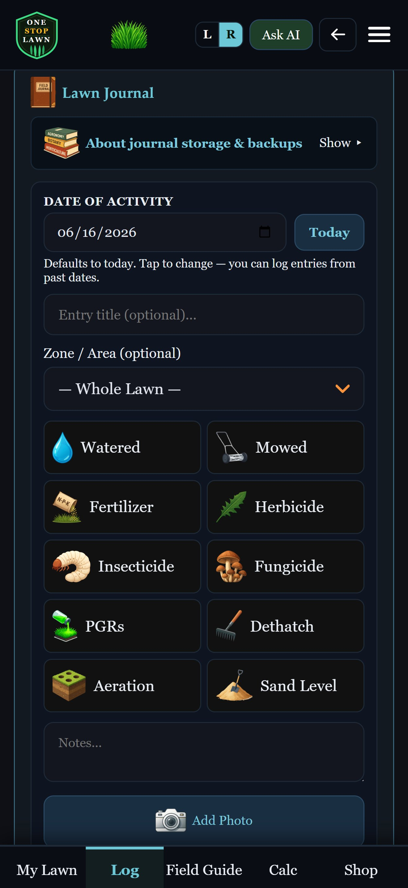
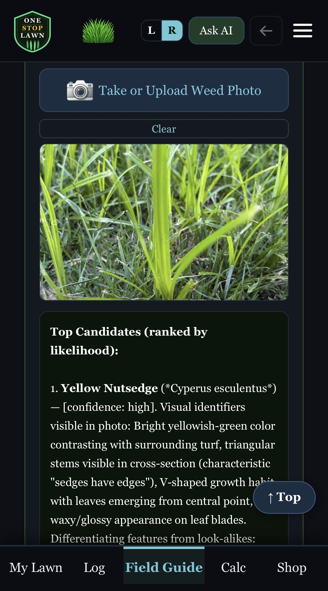
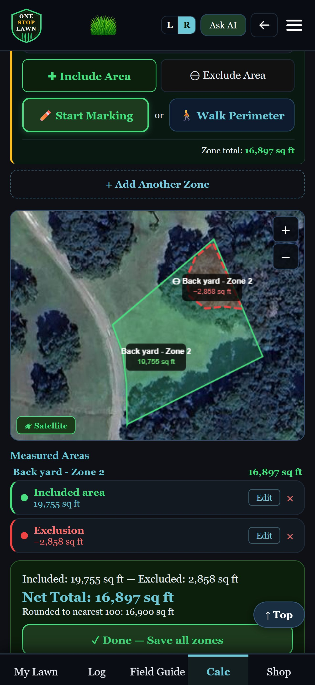

One Stop Lawn — Real AI Lawn Coaching

**One Stop Lawn**
No. 001 · Coming 2026
Made for serious lawns

The Lawn App With No Agenda

# Real AI lawn coaching, with no one to please.

We don't push our own fertilizer or products. We don't even have any. We link out to trusted brands so you can compare and choose — saving you the time of searching for them yourself.

Cheaper than a bag of premium fertilizer.

[Download on the
App Store](https://apps.apple.com/app/onestoplawn/idXXXXXXXXX "Download on the App Store")
[Get it on
Google Play](https://play.google.com/store/apps/details?id=com.onestoplawn.app "Get it on Google Play")

14-day free trial · No account required · Plans from $1.99/month

❦ · ❦ · ❦

A note from the Founder

> “I got tired of bouncing between apps, university extension sites, and Reddit threads just to figure out what was going on with my lawn. So I built One Stop Lawn — to put everything I actually reference in one place.”

— The founder, your fellow lawn enthusiast

Why One Stop Lawn

## Built for the lawns of people who actually care.

Free apps are free because they're selling you something. We chose a different path.

01 · Brand-Neutral

### No fertilizer to sell

We're not Scotts. We're not Yard Mastery. We don't make or sell products of our own — so our AI recommends what's actually right for your lawn, not house brands with quarterly numbers to hit. Some retailer links are affiliate links, but that never changes what we recommend.

02 · Real AI

### Photo-in, plan-out

Snap a weed, insect, or fungus and our AI identifies it and explains how to handle it — based on your grass type, your soil, your climate. Not a generic ZIP-code lookup.

03 · Any Soil Test

### From any lab

Bring soil tests from any university extension or commercial lab. Our AI translates the numbers into a clear, prioritized plan. Track chemistry across seasons and years.

04 · All-In-One

### One workflow, no juggling

Identify a weed → log it as a journal entry → see it tracked alongside your fertilizer schedule, soil tests, and zone history. Everything in one place. No spreadsheets.

What's Inside

## Everything you need to grow it right.

A serious toolkit, in your pocket.

### AI Identification

Weeds, insects, fungus, and grass type — identified instantly from a photo, with treatment recommendations rooted in your specific conditions.

### Soil Test Vault

Import any soil test, any lab. Track chemistry over years. Get AI-translated recommendations for what your lawn actually needs.

### Lawn Journal

Photos, notes, applications, watering — every event tagged by zone, every entry searchable. The lawn diary you'll actually keep.

### Smart Watering

Weather-aware schedules that adjust to rainfall and forecast. Optional Rachio sync auto-logs every cycle, every zone.

### Multi-Zone

Front yard, back yard, side strip, problem patches. Track each zone independently — products, water rates, and history.

### PDF Reports

Export polished PDFs of soil tests, applications, journal history. Keep your records, share with a service, or just admire your work.

❦ · ❦ · ❦

vs The Other Apps

## The honest comparison.

Most lawn apps were built to sell something. Here's what that costs you.

| Feature | One Stop Lawn | Yard Mastery | Scotts My Lawn | Lawn Care Journal |
| --- | --- | --- | --- | --- |
| AI weed/insect/fungus ID | Unlimited (Premium) | — | — | Limited |
| Custom soil test input | Any lab, any test | Brand kit only | — | Limited |
| AI treatment plans | Personalized | — | Generic by ZIP | Limited |
| Multi-zone tracking | ✓ | ✓ | — | ✓ |
| Rachio sprinkler sync | ✓ | — | — | — |
| Brand-neutral product picks | ✓ | Sells own | Sells Scotts | ✓ |
| PDF reports | Premium tier | — | — | — |
| Multi-property (pros/rentals) | Pro tier | — | — | — |

Plans & Pricing

## Pick a tier. Try it free for 14 days.

No account needed. Cancel anytime. Plans start at $1.99/month.

### Lawn Plus

Track your lawn, get AI help when you need it.

$12.99

per year

or $1.99/month

---

* 15 AI questions/month
* 1 lawn, unlimited zones
* Unlimited journal entries
* 5 soil test entries
* Smart watering schedule

Recommended

### Lawn Premium

Unlimited AI coaching — your turfgrass expert in your pocket.

$24.99

per year

or $3.99/month

---

* Unlimited AI questions
* 1 lawn, unlimited zones
* Unlimited soil tests
* PDF reports
* Push notifications
* Rachio Smart Sprinkler sync

### Lawn Pro

Manage multiple properties with the same precision.

$39.99

per year

or $5.99/month

---

* Everything in Premium
* Up to 10 lawns
* Per-lawn Rachio sync
* Per-lawn PDF reports

### Lawn Enterprise

For lawn pros managing client properties.

$79.99

per year

or $11.99/month

---

* Everything in Pro
* Unlimited lawns
* Customer PDF reports

**Cheaper than a bag of fertilizer.** A 50-lb bag of quality fertilizer runs $40-60. Most lawns need 3-4 bags a year — that's $120-240 annually. Lawn Premium costs **$24.99/year**, less than half the price of a single bag, and pays for itself if it helps you skip even one wasted application.

Take A Look

## Built like a field journal, working like a coach.

Real screens from the app, ready to put to work in your yard.

## Stop guessing. Start growing.

Real AI lawn coaching, with no one to please. Cheaper than a bag of premium fertilizer.

[Download on the
App Store](https://apps.apple.com/app/onestoplawn/idXXXXXXXXX "Download on the App Store")
[Get it on
Google Play](https://play.google.com/store/apps/details?id=com.onestoplawn.app "Get it on Google Play")

14-day free trial · No account required · Cancel anytime

Got a question or feedback? [Send us a note →](https://tally.so/r/kd5xpd)

One Stop Lawn

The lawn app with no agenda.

One Stop Lawn, LLC  
Registered in South Carolina

#### Product

[Features](#)
[Pricing](#)
[Compared to others](#)

#### Legal & Support

[Privacy Policy](https://onestoplawnapp.com/privacy.html)
[Terms of Service](https://onestoplawnapp.com/terms.html)
[Data Deletion](https://onestoplawnapp.com/delete-data.html)
[Contact us](mailto:support@onestoplawnapp.com)

#### Company

[Press & media kit](press.html)

**Affiliate disclosure:** Some links to products and retailers are affiliate links. As an Amazon Associate, One Stop Lawn earns from qualifying purchases. This comes at no extra cost to you and never influences which products we or our AI recommend.

© 2026 One Stop Lawn, LLC. All rights reserved.
onestoplawnapp.com
